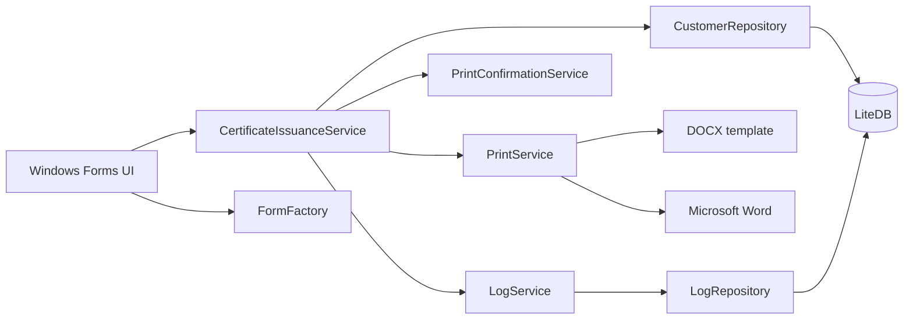

# MedCert

**MedCert** — локальное Windows-приложение для формирования, проверки и печати медицинских сертификатов по утверждённому шаблону.

Приложение разработано для реального медицинского учреждения и эксплуатируется на рабочем месте оператора более четырёх лет. Система работает автономно, не требует внешних сервисов и хранит данные локально во встроенной базе LiteDB.

> **Статус:** используется в реальной эксплуатации
> **Тип:** однопользовательское desktop-приложение
> **Среда:** одно рабочее место, Windows, без внешних сервисов

<!-- Добавить только обезличенный скриншот. -->

<!--  -->

## Задача

До внедрения приложения данные сертификата переносились в документ вручную. Это занимало время и создавало риск опечаток, повторного ввода и потери истории выданных документов.

MedCert автоматизирует рабочий сценарий:

1. Оператор вводит или выбирает данные пациента.
2. Приложение подставляет значения в DOCX-шаблон.
3. Сформированный документ открывается в Microsoft Word.
4. Оператор проверяет документ и печатает его на бланке.
5. После подтверждения успешной печати запись сохраняется в LiteDB.
6. Ранее выданный сертификат можно найти и распечатать повторно без создания дубликата.

## Возможности

* формирование сертификата по DOCX-шаблону;
* подстановка данных пациента, результатов осмотра и врачей;
* открытие документа для проверки и печати;
* подтверждение фактической печати оператором;
* сохранение истории выданных сертификатов;
* поиск записей по ФИО;
* повторная печать без дублирования записи;
* ведение справочника врачей;
* журналирование ошибок, предупреждений и информационных событий;
* защита от запуска нескольких экземпляров приложения;
* проверка блокировки выходного документа.

## Production-опыт

Это не демонстрационный CRUD-проект. MedCert создан под конкретный процесс медицинского учреждения, внедрён и поддерживается в эксплуатации более четырёх лет.

Проект демонстрирует:

* анализ реальной предметной области;
* автоматизацию ручного процесса;
* интеграцию с DOCX-шаблонами и Microsoft Word;
* работу с локальным хранилищем;
* обработку ошибок файловой системы и внешнего приложения;
* постепенный рефакторинг production-системы;
* тестирование критического сценария выдачи сертификата.

## Архитектура



Критический сценарий вынесен из формы в `CertificateIssuanceService`. Он координирует формирование документа, подтверждение печати и сохранение результата.

Результат операции представлен явным статусом:

* `PrintedAndSaved`;
* `RepeatPrintConfirmed`;
* `PrintNotConfirmed`;
* `DocumentGenerationFailed`;
* `StorageFailed`.

Это позволяет различать ошибку формирования, отказ от подтверждения и ситуацию, когда сертификат уже напечатан, но запись не удалось сохранить.

## Структура решения

```text
MedCert.sln
├── WindowsFormsApp1/
│   ├── Data/Repositories/
│   ├── Models/
│   ├── Services/
│   ├── WinForms/
│   ├── Resources/TemplatesDocx/
│   ├── Program.cs
│   └── MedCert.csproj
└── MedCert.Tests/
    ├── Data/
    └── Services/
```

> `WindowsFormsApp1` — историческое название проекта. При следующем крупном рефакторинге его целесообразно переименовать в `MedCert.Desktop`.

## Технологии

* C# и .NET Framework 4.8;
* Windows Forms;
* LiteDB 5.0.15;
* EasyDox для заполнения шаблона;
* Microsoft Word для проверки и печати;
* Microsoft.Extensions.DependencyInjection;
* Repository и Unit of Work;
* NUnit 4 и Moq.

## Надёжность сценария печати

* наличие шаблона проверяется до формирования документа;
* выходная папка создаётся автоматически;
* заблокированный документ не перезаписывается;
* ошибка формирования не приводит к сохранению записи;
* запись сохраняется только после подтверждения оператора;
* повторная печать не создаёт дубликат;
* ошибка сохранения возвращается отдельным результатом и журналируется.

## Тесты

В решении находится **28 NUnit-тестов**, покрывающих:

* успешную выдачу сертификата;
* ошибку формирования документа;
* отказ оператора от подтверждения печати;
* повторную печать без дублирования записи;
* ошибку сохранения после печати;
* CRUD-операции репозитория пациентов;
* транзакции `UnitOfWork`;
* автоматический rollback при освобождении объекта.

Запуск в Visual Studio:

```text
Test -> Test Explorer -> Run All
```

## Требования

Для разработки:

* Windows 10 или Windows 11;
* Visual Studio 2022 с workload **.NET desktop development**;
* .NET Framework 4.8 Developer Pack;
* восстановленные NuGet-пакеты.

Для работы приложения:

* Windows;
* .NET Framework 4.8;
* Microsoft Word или совместимое приложение для открытия документа;
* установленный принтер.

## Сборка и запуск

```powershell
git clone https://github.com/KarpenkoDima/MedCert.git
cd MedCert
nuget restore Medcert.sln
msbuild Medcert.sln /p:Configuration=Release
```

Либо откройте `Medcert.sln` в Visual Studio 2022, восстановите NuGet-пакеты и запустите проект `MedCert`.

Перед запуском проверьте наличие каталогов:

```text
Data/DB/
Resources/TemplatesDocx/
```

Основные пути задаются в `App.config`:

```xml
<connectionStrings>
  <add name="LiteDB"
       connectionString="Filename=.\Data\DB\database.db" />
</connectionStrings>

<appSettings>
  <add key="templateDocx"
       value="\Resources\TemplatesDocx\template_form100o_2.docx" />
  <add key="outputDoc"
       value="\Resources\TemplatesDocx\output.doc" />
</appSettings>
```

Production-база и сформированные документы не должны храниться в Git.

## Ограничения

* приложение работает только в Windows;
* рассчитано на одно локальное рабочее место;
* зависит от установленного приложения для открытия DOC/DOCX;
* формирование документа выполняется синхронно;
* UI и прикладные компоненты пока находятся в одном основном проекте;
* используется классический формат проекта .NET Framework.

Эти ограничения соответствуют исходной задаче: небольшая автономная система для конкретного рабочего места, а не распределённый сервис.

## Возможное развитие

* переход на SDK-style project и современную версию .NET;
* разделение на `Domain`, `Application`, `Infrastructure` и `Desktop`;
* создание уникального выходного файла для каждой операции;
* изоляция генератора документов за отдельным интерфейсом;
* добавление миграций локальной базы;
* сборка и запуск тестов в GitHub Actions;
* создание инсталлятора и механизма обновления.

## Конфиденциальность

Публичный репозиторий не должен содержать:

* production-базу LiteDB;
* персональные или медицинские данные;
* реальные журналы приложения;
* сформированные сертификаты;
* необезличенные скриншоты;
* закрытые реквизиты медицинского учреждения.

В репозитории должны использоваться только демонстрационные данные и обезличенный шаблон.

## Лицензия

MIT. Перед публикацией необходимо указать правильные имя владельца и год в `LICENSE.txt`.

## Автор

**Dmytro Karpenko**
C# / .NET Developer
